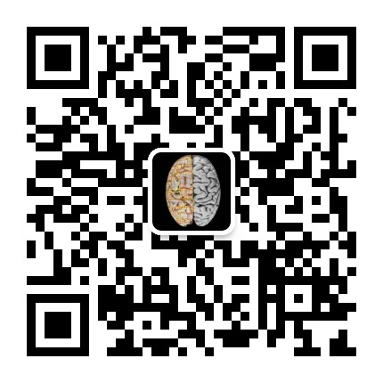

# 计算精神病学在线文献报告讨论会(Computational psychiatry online journal club(CPoJC))

* 组委会成员： [Haiyang Geng 耿海洋(HKU)](https://www.psychology.hku.hk/scnlab/people.html), [Ruyuan Zhang 张洳源(SJTU)](http://ruyuanzhang.github.io/), [Ying Li李瑛(BJCH)](https://scholar.google.com/citations?user=ae_5wyMAAAAJ&hl=en&oi=ao), [Chao Li黎超(CMU)](https://github.com/easylearn-fmri/easylearn_dev), [Lei Zhang张磊(VU)](https://lei-zhang.net/about/)

* 微信群：计算精神病学

* 腾讯会议房间：ID: 807 5230 8551

* 时间： 每周四晚上8点(北京时间)	

* 欢迎对这个主题感兴趣的老师同学进群，大家一起学习讨论。联系邮箱：ccpn2021@foxmail.com
* 合作组织：[Chinese Open Science Network(COSN)](https://open-sci.cn/)(也可以关注 COSN Events，我们会定期更新JC的相关信息)

**报告讨论会目的：**

1. 加强领域内同行的讨论和交流。
2. 促进基础研究领域和临床领域的合作。

**请加小助手微信入群**：

## 日程安排

| 期号 |                             文献                             | 报告人 | 日期 |      |
| :--: | :----------------------------------------------------------: | :----: | ---- | ---- |
|      | Peterson, J. C., Bourgin, D. D., Agrawal, M., Reichman, D., & Griffiths, T. L. (2021). Using large-scale experiments and machine learning to discover theories of human decision-making. *Science*, *372*(6547), 1209–1214. https://doi.org/10.1126/science.abe2629 | 窦皓然 | 待定 |      |
|      |                                                              |        |      |      |

## 往期报告

| 期号 | 文献                                                         |   报告人    | 日期     | 相关材料                                                     |
| :--: | :----------------------------------------------------------- | :---------: | -------- | ------------------------------------------------------------ |
|  1   | Pavlovian conditioning–induced hallucinations result from overweighting of perceptual priors. Science, 357(6351), 596–600. https://doi.org/10.1126/science.aan3458 |   耿海洋    | 12月24日 |                                                              |
|  2   | An integrative framework for perceptual disturbances in psychosis. Nature Reviews Neuroscience, 20(12), 763–778. https://doi.org/10.1038/s41583-019-0234-1 |    李瑛     | 12月31日 |                                                              |
|  3   | Anxious individuals have difficulty learning the causal statistics of aversive environments. Nature Neuroscience, 18(4), 590–596. https://doi.org/10.1038/nn.3961 | 全湘 张洳源 | 1月28日  |                                                              |
|  4   | Identifying and validating subtypes within major psychiatric disorders based on frontal–posterior functional imbalance via deep learning. Molecular Psychiatry. https://doi.org/10.1038/s41380-020-00892-3 |    黎超     | 2月4日   |                                                              |
|  5   | Identification of neurobehavioural symptom groups based on shared brain mechanisms. Nature Human Behaviour, 3(12), 1306–1318. https://doi.org/10.1038/s41562-019-0738-8 |    刘威     | 2月25日  |                                                              |
|  6   | Gagne, C., Zika, O., Dayan, P., & Bishop, S. J. (2020). Impaired adaptation of learning to contingency volatility in internalizing psychopathology. ELife, 9, e61387. https://doi.org/10.7554/eLife.61387 |   王志豪    | 3月11日  |                                                              |
|  7   | Computational psychiatry Intro                               |    张磊     | 3月25日  | [视频](https://www.bilibili.com/video/BV1SK411c7UJ/), [PPT](https://github.com/lei-zhang/COSN_webinar/tree/master/20210325_Computational_Psychiatry) |
|  8   | Hein, T. P., de Fockert, J., & Ruiz, M. H. (2021). State anxiety biases estimates of uncertainty and impairs reward learning in volatile environments. NeuroImage, 224, 117424. https://doi.org/10.1016/j.neuroimage.2020.117424 |   窦皓然    | 4月8日   | [视频](https://www.bilibili.com/video/BV1sp4y1t72K/), [PPT](https://github.com/coolspiderghy/Computational_Psychiatry_online_Journal_Club/blob/main/SM/journal%20club-HGF-0408.pdf) |
|  9   | Shin, Y. S., & Niv, Y. (2021). Biased evaluations emerge from inferring hidden causes. *Nature Human Behaviour*, 1–10. https://doi.org/10.1038/s41562-021-01065-0 |   潘晚坷    | 4月29日  | [视频](https://www.bilibili.com/video/BV1of4y1p7gD/),[PPT](https://github.com/coolspiderghy/Computational_Psychiatry_online_Journal_Club/blob/main/SM/Biased%20evaluations%20emerge%20from%20inferring%20hidden%20causes%20.pdf) |
|  10  | Lei, H., Mochizuki, Y., Chen, C., Hagiwara, K., Hirotsu, M., Matsubara, T., & Nakagawa, S. (2021). Sex difference in the weighting of expected uncertainty under chronic stress. *Scientific Reports*, *11*(1), 8700. https://doi.org/10.1038/s41598-021-88155-1 |   雷慧洁    | 5月13日  | [PPT](https://github.com/coolspiderghy/Computational_Psychiatry_online_Journal_Club/blob/main/SM/Sex%20difference%20in%20the%20weighting%20of%20expected%20uncertainty%20under%20chronic%20stress-Huijie%20Lei.pdf) |
|  11  | van Baar, J. M., Chang, L. J., & Sanfey, A. G. (2019). The computational and neural substrates of moral strategies in social decision-making. *Nature Communications*, *10*(1), 1483. https://doi.org/10.1038/s41467-019-09161-6 |   金悦宁    | 5月27 日 | [视频](https://www.bilibili.com/video/BV1TU4y1j7jU/), [PPT](https://github.com/coolspiderghy/Computational_Psychiatry_online_Journal_Club/blob/main/SM/Biased%20evaluations%20emerge%20from%20inferring%20hidden%20causes%20.pdf) |

## 推荐阅读

| 序号 | 文献                                                         | 等级（5为最高） |
| :--: | ------------------------------------------------------------ | --------------- |
|  1   | Wilson, R. C., & Collins, A. G. (2019). Ten simple rules for the computational modeling of behavioral data. *ELife*, *8*, e49547. https://doi.org/10.7554/eLife.49547 | 5               |
|  2   | Dwyer, D. B., Falkai, P., & Koutsouleris, N. (2018). Machine Learning Approaches for Clinical Psychology and Psychiatry. *Annual Review of Clinical Psychology*, *14*(1), 91–118. https://doi.org/10.1146/annurev-clinpsy-032816-045037 | 3               |
|  3   | Kotov, R., Krueger, R. F., Watson, D., Cicero, D. C., Conway, C. C., DeYoung, C. G., Eaton, N. R., Forbes, M. K., Hallquist, M. N., Latzman, R. D., Mullins-Sweatt, S. N., Ruggero, C. J., Simms, L. J., Waldman, I. D., Waszczuk, M. A., & Wright, A. G. C. (2021). The Hierarchical Taxonomy of Psychopathology (HiTOP): A Quantitative Nosology Based on Consensus of Evidence. *Annual Review of Clinical Psychology*, *17*(1), 83–108. https://doi.org/10.1146/annurev-clinpsy-081219-093304 | 4               |
|  4   | Weiss, A., Chambon, V., Lee, J. K., Drugowitsch, J., & Wyart, V. (2021). Interacting with volatile environments stabilizes hidden-state inference and its brain signatures. *Nature Communications*, *12*(1), 2228. https://doi.org/10.1038/s41467-021-22396-6 | 4               |
|  5   | van de Schoot, R., Depaoli, S., King, R., Kramer, B., Märtens, K., Tadesse, M. G., Vannucci, M., Gelman, A., Veen, D., Willemsen, J., & Yau, C. (2021). Bayesian statistics and modelling. *Nature Reviews Methods Primers*, *1*(1), 1–26. https://doi.org/10.1038/s43586-020-00001-2 | 5               |

## 国际认知计算神经科学前沿研讨会

|                             名字                             | 简介                                                         | 时间                                |
| :----------------------------------------------------------: | ------------------------------------------------------------ | ----------------------------------- |
| [MAPs: Methods And Primers for Computational Psychiatry and Neuroeconomics](https://medicine.yale.edu/psychiatry/map/) | 由耶鲁大学医学院Al Powers等人组织，计算精神病学方法入门，领域中的大牛深入浅出讲解CP的方法和理论 | Monthly Thursdays 4:00 – 5:00 pm ET |
| [Transcontinental Computational Psychiatry Workgroup (TCPW)](https://www.quentinhuys.com/tcpw/) | 由Quentin Huys组织，计算精神病学领域大牛，每月一次的seminar  | Monthly                             |
| [Computational Cognitive Science Colloquium 2020/2021](https://www.tu-darmstadt.de/cogsci/ccs_news/detailseite_news_175360.en.jsp) | Technische Universität Darmstadt组织，认知计算神经科学seminar | Weekly Wednesday 3:20-5:00 pm GMT+1 |
|    [World Wide Neuro](https://www.world-wide.org/Neuro/)     | 认知计算神经科学全球seminar信息集散地                        | Daily                               |
| [Brain Imaging Research Center Seminars](https://birc.uconn.edu/events/speaker-series/#) | UNIVERSITY OF CONNECTICUT举办，认知神经科学                  | Monthly Tuesday 12-1：30 pm ET      |
|     [The Learning Salon](https://www.learningsalon.ai/)      | A weekly forum in which we explore bridges and contentions in biological and artificial learning. 由 Ida Momennejad等人组织，注重对领域基本问题的深刻讨论。 | Weekly Friday, 4:00 pm EST          |
|         [BRAIN INSPIRED](https://braininspired.co/)          | 由Paul Middlebrooks主持，一个讨论AI和brain science交叉的prodcast，主持人与业界大牛的对谈，主持人的问题很专业。 |                                     |